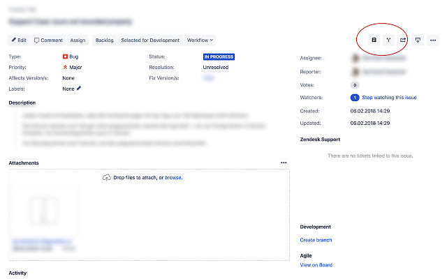

# ⚡️ jira-issue-copy ⚡️

Safari Extension inserting buttons for fast copy of issue key + summary for better copy&amp;paste usage.

This is actually a port of the chrome extension from: [daberni/jira-copy-comments](https://github.com/daberni/jira-copy-comments)

## Download

* Download old version for Safari <= 11.x here 👉 [Safari extension](https://github.com/patricks/jira-issue-copy/raw/master/release/jira-issue-copy.safariextz)
* Download new version for Safari >= 12.x here 👉 Soon

## Screenshot

